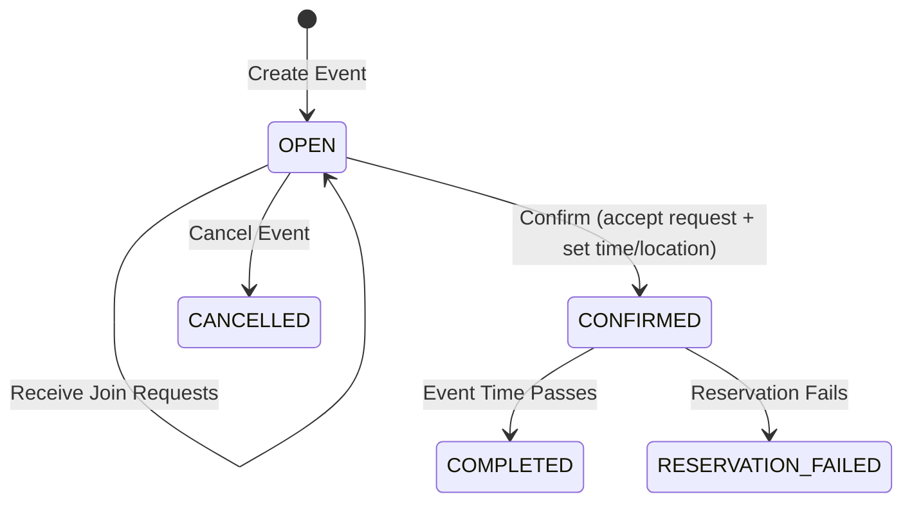

# XTP Tour

Tennis hitting partner finder

## Event Lifecycle



**Flow:** Creator creates event → Users send join requests → Creator confirms with selected request → Event completes after scheduled time.


### Environment Variables

The combined container supports the following environment variables:

| Variable | Description | Default | Required |
|----------|-------------|---------|----------|
| `DB_HOST` | MySQL database host | - | Yes |
| `DB_PORT` | MySQL database port | `3306` | No |
| `DB_USER` | MySQL database username | - | Yes |
| `DB_PASSWORD` | MySQL database password | - | Yes |
| `DB_NAME` | MySQL database name | `xtp_tour` | No |
| `PORT` | Port the server listens on | `8080` | No |
| `AUTH_TYPE` | Authentication type (`clerk` or `test`) | - | Yes |
| `CLERK_FRONTEND_API` | Clerk frontend API key (if using Clerk auth) | - | Required if `AUTH_TYPE=clerk` |
| `CLERK_SECRET_KEY` | Clerk secret key (if using Clerk auth) | - | Required if `AUTH_TYPE=clerk` |

### Running with environment variables

```bash
docker run -p 8080:8080 \
  -e DB_HOST=mysql.example.com \
  -e DB_USER=dbuser \
  -e DB_PASSWORD=dbpass \
  -e DB_NAME=xtp_tour \
  -e AUTH_TYPE=clerk \
  -e CLERK_FRONTEND_API=pk_test_123 \
  -e CLERK_SECRET_KEY=sk_test_456 \
  --name xtp-tour-app \
  xtp-tour
```


## Test user
Email: test@example.com
Password: adf_asdf_as_wer
