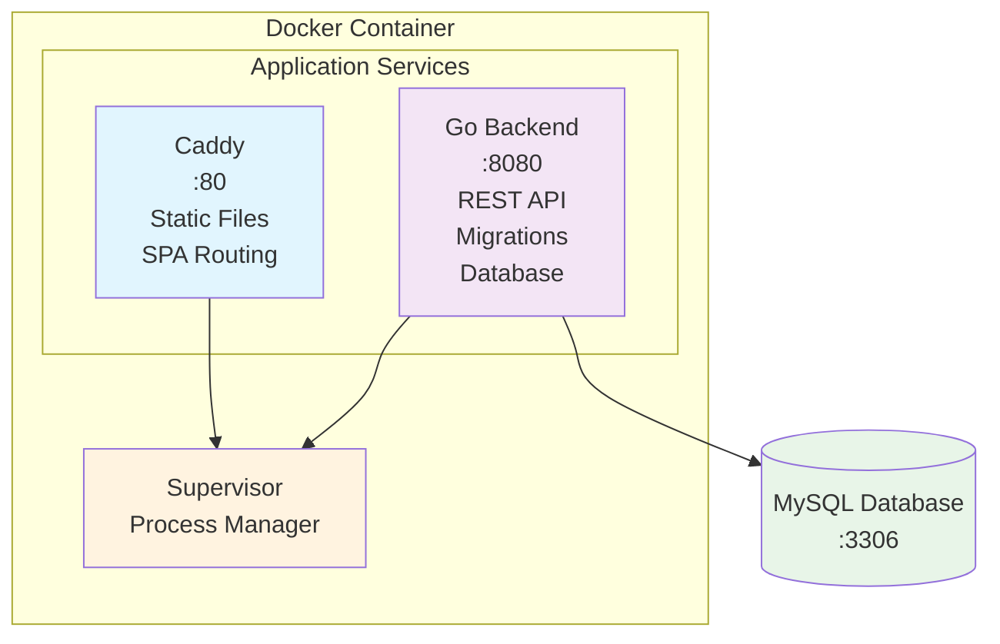

# Docker Setup for XTP Tour

This document describes the Docker setup for the XTP Tour application, which combines a React frontend and Go backend in a single container.

## Architecture

The application uses a single Docker container with:
- **Caddy**: Serves the React frontend static files on port 80
- **Go Backend**: Provides the API directly on port 8080
- **Supervisor**: Manages both processes within the container
- **MySQL**: Separate database container



## File Structure

This directory contains the Docker deployment configuration for the XTP Tour application:

- `docker-compose.yaml` - Base configuration with MySQL and Adminer services
- `docker-compose.deploy.yml` - Deployment configuration that extends the base with the application service
- `Dockerfile.deploy` - Multi-stage Dockerfile for building the full-stack application (frontend + backend)
- `.env` - Environment variables configuration

## Port Configuration

- **Frontend**: http://localhost:80 (Caddy serving React SPA)
- **API**: http://localhost:8080 (Go backend direct access)
- **Database**: localhost:33306 (MySQL)
- **Adminer**: http://localhost:38080 (Database management)

## Quick Start

### Development (MySQL + Adminer only)
```bash
docker compose up mysql adminer
```

### Full Deployment (Application + MySQL + Adminer)
```bash
docker compose -f docker-compose.yaml -f docker-compose.deploy.yml up
```

### Build and Deploy
```bash
# Build the application
docker compose -f docker-compose.yaml -f docker-compose.deploy.yml build

# Run the full stack
docker compose -f docker-compose.yaml -f docker-compose.deploy.yml up -d
```

### Check logs
```bash
docker compose -f docker-compose.yaml -f docker-compose.deploy.yml logs -f app
```

### Access the application
- Frontend: http://localhost:80
- API: http://localhost:8080/api/health
- API Documentation: http://localhost:8080/swagger/
- Database Management: http://localhost:38080

### Stop the application
```bash
docker compose -f docker-compose.yaml -f docker-compose.deploy.yml down
```

## Container Services

The main application container runs two services managed by Supervisor:

### Frontend Service (Caddy)
- Serves React static files from `/usr/share/caddy`
- Handles SPA routing (fallback to `index.html`)
- Applies security headers and caching policies
- Listens on port 80 inside container

### Backend Service (Go)
- Runs database migrations on startup
- Provides REST API endpoints
- Listens on port 8080 inside container
- Serves OpenAPI documentation at `/swagger/`

## Environment Variables

The deployment uses the `.env` file in the api directory for configuration. Make sure to set up your environment variables before deployment.

| Variable | Default | Description |
|----------|---------|-------------|
| `DB_HOST` | `mysql` | Database hostname |
| `DB_PORT` | `3306` | Database port |
| `DB_USER` | `root` | Database username |
| `DB_PASSWORD` | `password` | Database password |
| `DB_NAME` | `xtp_tour` | Database name |
| `SERVICE_PORT` | `8080` | Go backend port |
| `LOG_LEVEL` | `info` | Logging level |
| `AUTH_TYPE` | `debug` | Authentication type |
| `AUTH_CONFIG` | `""` | Authentication configuration |

## Development

### Building the Image

```bash
# Build the image
docker compose -f docker-compose.yaml -f docker-compose.deploy.yml build

# Build without cache
docker compose -f docker-compose.yaml -f docker-compose.deploy.yml build --no-cache app
```

### Accessing Services

During development, you can access individual services:

```bash
# Check frontend health
curl http://localhost:80/health

# Check API health  
curl http://localhost:8080/api/health

# View API documentation
open http://localhost:8080/swagger/
```

### Database Access

```bash
# Connect to MySQL
docker compose exec mysql mysql -u root -ppassword xtp_tour

# View database logs
docker compose logs mysql

# Access Adminer
open http://localhost:38080
```

### Container Debugging

```bash
# Access the application container
docker compose -f docker-compose.yaml -f docker-compose.deploy.yml exec app sh

# Check supervisor status
docker compose -f docker-compose.yaml -f docker-compose.deploy.yml exec app supervisorctl status

# View individual service logs
docker compose -f docker-compose.yaml -f docker-compose.deploy.yml exec app supervisorctl tail -f backend
docker compose -f docker-compose.yaml -f docker-compose.deploy.yml exec app supervisorctl tail -f caddy
```

## Architecture Details

The deployment uses a multi-stage Docker build that:
1. **frontend-builder**: Builds React app with Node.js and pnpm
2. **backend-builder**: Builds Go binary with dependencies
3. **runtime**: Combines both with Caddy, using Supervisor for process management

The application serves the frontend on port 80 and the API on port 8080.

## Production Considerations

### Security
- Change default database password
- Use secure authentication configuration
- Consider running behind a load balancer with SSL termination
- Review and adjust security headers in Caddy configuration

### Performance
- Static assets are cached for 1 year
- HTML files are not cached to ensure updates are loaded
- Gzip compression is enabled
- Consider using a CDN for static assets

### Monitoring
- Health checks are configured for both the container and database
- Logs are output to stdout/stderr for container log aggregation
- Consider adding application metrics and monitoring

### Scaling
- Database can be externalized (remove `mysql` service, update `DB_HOST`)
- Frontend and backend are separated and can be scaled independently if needed
- Use container orchestration (Kubernetes, Docker Swarm) for production deployments

## Troubleshooting

### Common Issues

1. **Database connection errors**:
   - Ensure database is healthy: `docker compose ps mysql`
   - Check database logs: `docker compose logs mysql`

2. **Frontend not loading**:
   - Check Caddy logs: `docker compose -f docker-compose.yaml -f docker-compose.deploy.yml exec app supervisorctl tail caddy`
   - Verify build artifacts exist: `docker compose -f docker-compose.yaml -f docker-compose.deploy.yml exec app ls -la /usr/share/caddy`

3. **API not responding**:
   - Check backend logs: `docker compose -f docker-compose.yaml -f docker-compose.deploy.yml exec app supervisorctl tail backend`
   - Verify Go process is running: `docker compose -f docker-compose.yaml -f docker-compose.deploy.yml exec app supervisorctl status backend`

4. **Migration failures**:
   - Check backend startup logs for migration errors
   - Verify database connection and permissions

### Log Locations

- **Container logs**: `docker compose -f docker-compose.yaml -f docker-compose.deploy.yml logs app`
- **Database logs**: `docker compose logs mysql`  
- **Backend logs**: `docker compose -f docker-compose.yaml -f docker-compose.deploy.yml exec app supervisorctl tail backend`
- **Caddy logs**: `docker compose -f docker-compose.yaml -f docker-compose.deploy.yml exec app supervisorctl tail caddy`

## Configuration Validation

You can validate the Docker Compose configuration before running:

```bash
docker compose -f docker-compose.yaml -f docker-compose.deploy.yml config
```

This will show the merged configuration and help identify any issues before deployment. 